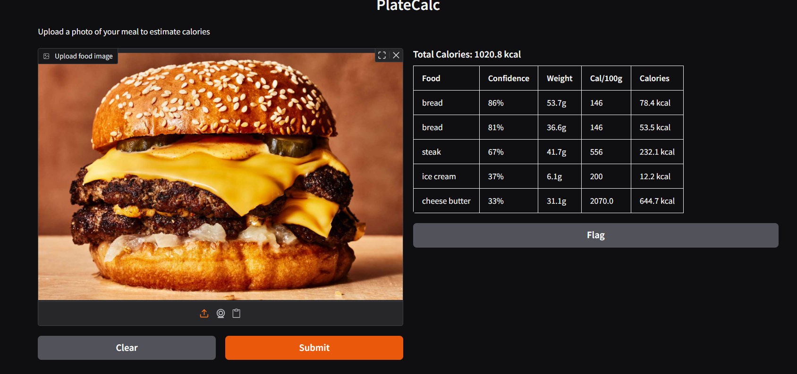

# PlateCalc

A computer vision system that estimates the calorie content of a meal 
from a single food image.

## Demo

## What it does

Upload a photo of a plate of food. PlateCalc detects each food item, 
estimates its portion size, and calculates the total calorie content 
using nutritional data from the USDA FoodData Central database.

## How it works

The pipeline has 4 stages:

**1. Detection & Segmentation**
A YOLOv8n-seg model trained on FoodSeg103 detects food items in the 
image and generates a segmentation mask for each one — a pixel-level 
outline of where each food is.

**2. Portion Estimation**
Foods are split into two categories:
- Countable items (eggs, apples, bananas etc): connected component 
  analysis counts individual instances, then multiplies by average 
  unit weight
- Region-based items (rice, curry, noodles etc): mask pixel area is 
  used as a proxy for portion size, assuming a full plate ≈ 500g

**3. Nutrition Lookup**
Each detected food label is queried against the USDA FoodData Central 
API to retrieve calories per 100g.

**4. Calorie Calculation**
calories = (estimated_weight_g / 100) × calories_per_100g
Individual values are summed to get total meal calories.

## Dataset & Training

- **Dataset**: FoodSeg103 — 7,118 food images across 103 categories 
  with pixel-level segmentation masks
- **Model**: YOLOv8n-seg (nano), fine-tuned from pretrained COCO weights
- **Training**: 50 epochs, batch size 16, image size 640×640, GPU T4
- **Best mAP50**: 0.238 (segmentation masks)

## Design Choices & Trade-offs

**Why YOLOv8?**
YOLOv8 is a one-stage detector that handles detection and segmentation 
in a single forward pass. It is fast, well-documented, and the 
ultralytics library makes training on custom datasets straightforward. 
The nano variant was chosen to keep training feasible within free GPU 
quota while still demonstrating the full pipeline.

**Why pixel area as a proxy for portion size?**
Accurate portion estimation from a 2D image is an unsolved problem — 
it would require depth information or a reference object in frame. 
Pixel area is a simple, interpretable heuristic that works reasonably 
for overhead shots of plates. The assumption is that a full plate 
≈ 500g, so a food region covering 20% of the image ≈ 100g.

**Why separate countable and region-based foods?**
Pixel area breaks down for countable items — 3 eggs in a pile has 
roughly the same pixel area as 1 egg spread out. Connected component 
analysis on the mask gives a more accurate count of discrete items.

**Dataset conversion**
FoodSeg103 provides semantic segmentation masks (PNG files where each 
pixel value = class ID). YOLOv8 requires instance segmentation format 
(polygon coordinates per object). A custom conversion script uses 
OpenCV's findContours on per-class binary masks to extract polygon 
outlines, then normalizes coordinates to 0-1 range.

## Limitations

- **Model accuracy**: mAP50 of 0.238 reflects constrained training 
  on free GPU quota. More epochs, data augmentation, and a larger 
  model variant would improve detection quality significantly.
- **False positives**: Low confidence detections (below 40%) can 
  produce incorrect labels — for example, the model identified 
  "ice cream" on a burger image, likely confusing yellow cheese 
  for ice cream. A stricter confidence threshold reduces this but 
  also removes valid detections.
- **USDA API generic search**: The API sometimes returns nutritional 
  data for processed variants instead of fresh ingredients. For 
  example, querying "cheese butter" returned clarified ghee 
  (2070 kcal/100g) instead of regular cheese (~400 kcal/100g). 
  A curated nutrition lookup table would be more accurate for 
  production use.
- **Portion estimation**: Pixel area assumes an overhead view of a 
  flat plate. Stacked foods or angled shots will give inaccurate 
  weight estimates.
- **Dataset bias**: FoodSeg103 is predominantly Chinese/Asian cuisine. 
  Performance on Western foods may be lower.
- **Overlapping foods**: Where foods overlap, masks may merge, 
  affecting both classification and portion estimates.

## Setup & Running

This project runs in a Kaggle Notebook with GPU enabled.

Model weights are available as a Kaggle dataset at: https://www.kaggle.com/datasets/amgdotexe/platecalc-weights

For training:
1. Open the training notebook on Kaggle
2. Ensure GPU T4 and Internet are enabled under Settings
3. Add the FoodSeg103 dataset (ggrill/foodseg103) as an input
4. Run all cells in order — training takes approximately 2.5 hours

For inference:
1. Open the inference notebook on Kaggle
2. Add the platecalc-weights dataset as an input
3. Add the FoodSeg103 dataset as an input
4. Run all cells in order
5. The Gradio UI will launch with a public URL

## Tech Stack

- YOLOv8 (ultralytics)
- OpenCV
- USDA FoodData Central API
- Gradio
- Python 3.12
